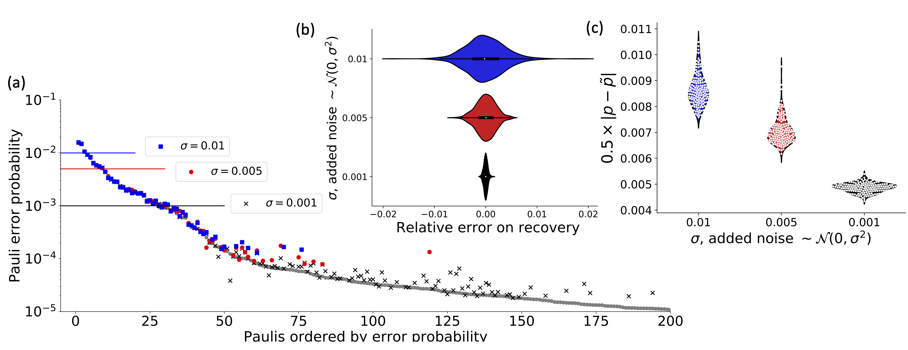

# Scalable Estimation Documentation


```@contents
Pages = ["peel.md", "localPeel.md"]
Depth = 2
```

# Introduction 

This is the documentation of the code used to implement the algorithm discussed in the paper **Fast estimation of sparse quantum noise** by *Harper, Yu and Flammia* (in production).

There are a number of IJulia workbooks that accompany this code that detail the use of the software and the implementation of the algorithm.

They are as follows:
- **ScalableEstimation.ipynb**. This is the main workbook that reproduces all the diagrams and charts in the paper. It assumes some knowledge of the algorithm and uses experimental data as the basis for the distribution it recreates.
- **Hadamard Basics and Observations.ipynb**. A work book setting out some of the basic concepts behind the Walsh-Hadamard transform, the global probability vector and the SuperOperator (Pauli basis) Eigenvalues and measurements (observations). If you are a bit unclear on these terms, this might be a good place to start.
- **Scalable Estimation - Basic Concepts.ipynb**. This is a small qubit, no noise work through of the protocol. If you are a bit unclear on some of the more basic concepts, this aims to cover those.
- **Scalable Estimation - Experimental Basics.ipynb**. This shows how to create the circuits needed to get the eigenvalues to run the protocol. Because of the limitations of the simulaton it is only for 6 qubits, which are too few to justify the protocol. The workbook is long and contains a wealth of data output - if you are trying to write your own version of the protocol this will be a useful tool to debug. If you just want to learn how to run appropriate circuits, the qiskit workbooks (below) are probably a better bet.
- **Scalable Estimation - Experimental Qiskit- Just 3 qubits.ipynb**. This shows how to create, run and the circuits and the *peel* the results using qiskit and the AER simulator. It is only 3 qubits, so *not at all* the size this is aimed at, but the simulation runs quite fast! It may be helpful to see how to do it on your bigger system.


Figure 2 from the paper, shows the type of recovery that is possible using the code and cicuits discussed here


## Scalable Estimation

The main workbook uses data taken from the IBM Quantum Experience (Melbourne device, when it only had 14 qubits), uses that to create a full Pauli distribution and then attempts to reconstruct the distribution from limited sampling of the eigenvalues corrupted by varying levels of noise. It contains the code, analysis and figures that appear in the paper. It does, however, assume a certain level of knowledge which is the point of the workbooks also contained in this repository

It implicilty uses the algorithm detailed in **Efficient Learning of quantum Noise** [arXiv:1907.13022](https://arxiv.org/abs/1907.13022) , code for which is located at https://github.com/rharper2/Juqst.jl. Python code to run such experiments on the IBM Quantum Experience (using qiskit) can be found on https://github.com/rharper2/query_ibmq.


Copyright: Robin Harper 2019-2020

