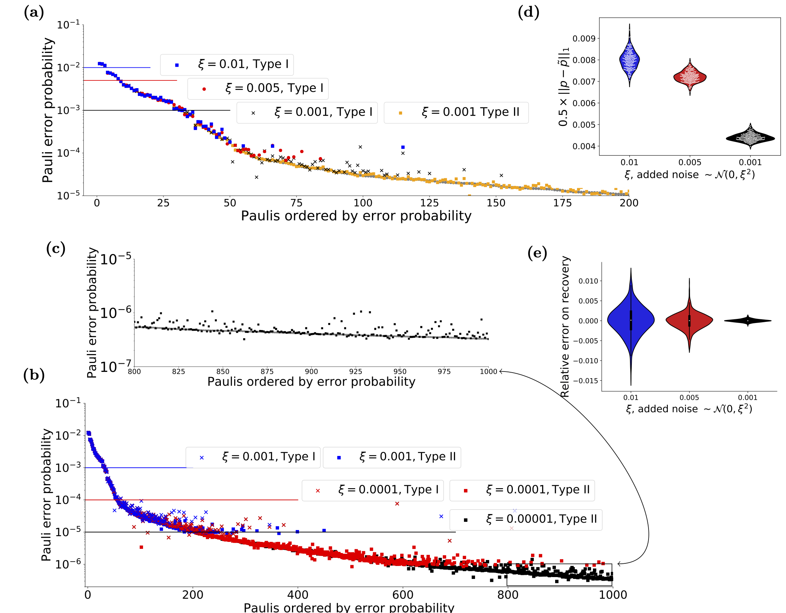
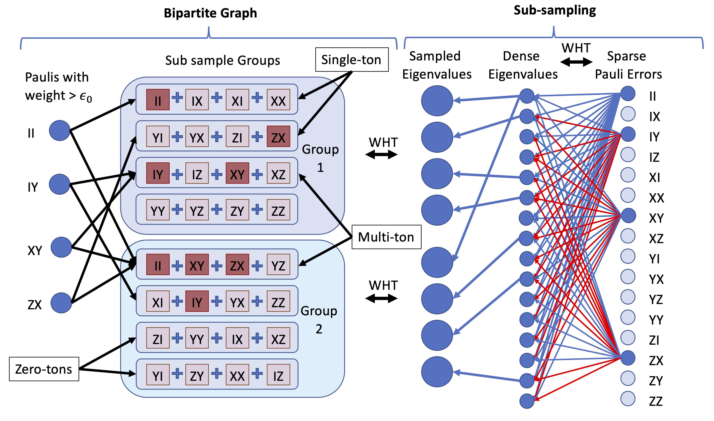

# Scalable Estimation Documentation


```@contents
Pages = ["peel.md", "localPeel.md"]
Depth = 2
```

# Introduction 

This is the documentation of the code used to implement the algorithm discussed in the paper **Fast estimation of sparse quantum noise** by *Harper, Yu and Flammia* (in production).

There are a number of IJulia workbooks that accompany this code that detail the use of the software and the implementation of the algorithm. They are detailed in the section [Example workbooks](@ref).



Figure 1 from the paper, shows the type of recovery that is possible using the code and cicuits discussed here


## Scalable Estimation

The main workbook uses data taken from the IBM Quantum Experience (Melbourne device, when it only had 14 qubits), uses that to create a full Pauli distribution and then attempts to reconstruct the distribution from limited sampling of the eigenvalues corrupted by varying levels of noise. It contains the code, analysis and figures that appear in the paper. It does, however, assume a certain level of knowledge which is the point of the workbooks also contained in this repository

It implicilty uses the algorithm detailed in **Efficient Learning of quantum Noise** [arXiv:1907.13022](https://arxiv.org/abs/1907.13022) , code for which is located at [https://github.com/rharper2/Juqst.jl](https://github.com/rharper2/Juqst.jl). Python code to run such experiments on the IBM Quantum Experience (using qiskit) can be found on [https://github.com/rharper2/query_ibmq](https://github.com/rharper2/query_ibmq).

## Overview of the steps required

The workbooks contains examples showing all the steps necessary, but it might be helpful here for me to cover the basics.

The actual algorithm, assumes an eigenvalue oracle, but here we also show how to construct such an oracle in practice. The following picture might help, the left hand-side of the picture might be though of as the recovery algorithm, the right hand side is the sub-sampling algorithm - i.e. the procedure to create the 'eigenvalue' oracle.



On a practical level the first thought might be how do I sable the eigenvalues of the averaged noise channel of my device. The algorithms here are a variation of randomised benchmarking and the concepts behind them are detailed in two papers [arXiv:1907.13022](https://arxiv.org/abs/1907.13022) and [arxiv:1907.12976](https://arxiv.org/abs/1907.12976). Basically this allows us to recover upto $2^n$ commuting eigenvalues 'per' experiment, where $n$ is the number of qubits in the machine. To recover an arbitrary set of commuting eigenvalues in an experiment would require the ability to create $n$-qubit Clifford gates, which is probably impractical. The first step then is to create an ansatz where we can design an experiment that recovers the Pauli eigenvalues we need using only two local gates.

The Local stabiliser part of the package is designed to make this easy. The workbook Scalable Estimation - Experimental Qiskit- Just 3 qubits [Web friendly version](renderedWorkbooks/Scalable Estimation - Experimental Qiskit- Just 3 qubits.html), shows how to do this all in qiskit for a small system - easily expandable. The functions to look at include [`generateSensibleSubsamples`](@ref), where if you give it your two qubit connectivity will suggest the type of sub samples you might need and the appropriately named [`getCircuit`](@ref) which takes the output of the previous function and generates a circuit of the depth you want. Like randomised benchmarking we use a number of runs at varying 'depths' to generate a decay curve. It's just that we generate $2^n$ decay curves!

(Note if all the above means little to you, there are a couple of other introductory workbooks that may prove helpful.)

Two such experiments as described above, will begin to fill in the 'oracle', i.e. we now have the bins that appear on the right hand side of the bi-partite graph in the diagram above. However, we still need to be able to answer the questions "Is there a single Pauli of weight in the bin (red in the diagram)?" and "If so - which Pauli is it".  Currently the only way we have to do this is to generate 'offset' eigenvalues. (The paper explains this in detail). So how do we generate these? Well basically for every two qubit groups there are 5 different type of local variation (and we have already done one of them). We just need to cycle through the qubit pairs and do the other 4. You can see how this is done in the various workbooks using the code, but basically in *very bad* pseudo code it is this:

```
For pair in QubitPairs:
	For experimentType in 1..5:
		if not we have already done that experiment type on pair: 
		   do the experiment, with with experimentType on pair, and add the eigenvalues to the oracle.
```

So each pair of qubits will have require a further 4 expements, giving us a total of $2n$ new experiments per sub-sampling group. 

Once we have that we have our eigenvalue oracle and we have generated our bins, then its then just a question of iteratively going through the bins. We ask "is there a single Pauli in there?". If there is we have the value of that Pauli error. When we identify a Pauli we can see if it is part of a bin containing other Paulis and substract it out (we call this peeling). So for instance, in the diagram above - in Group 2 you can see that Pauli $IY$ is sitting alone in a bin. We can then find its value and subtract it from bin 3 in Group 1. When we do that there is only one Pauli in that bin (Pauli $XY$) and so we also get that one!

The code is, like a lot of code, slightly fiddly - but I have done my best to set it out in the example workbooks. The easiest way to understand that is to look at the noiseless example first [Scalable Estimation-Basic Concepts](renderedWorkbooks/Scalable Estimation - Basic Concepts.html).


Copyright: Robin Harper 2019-2020

